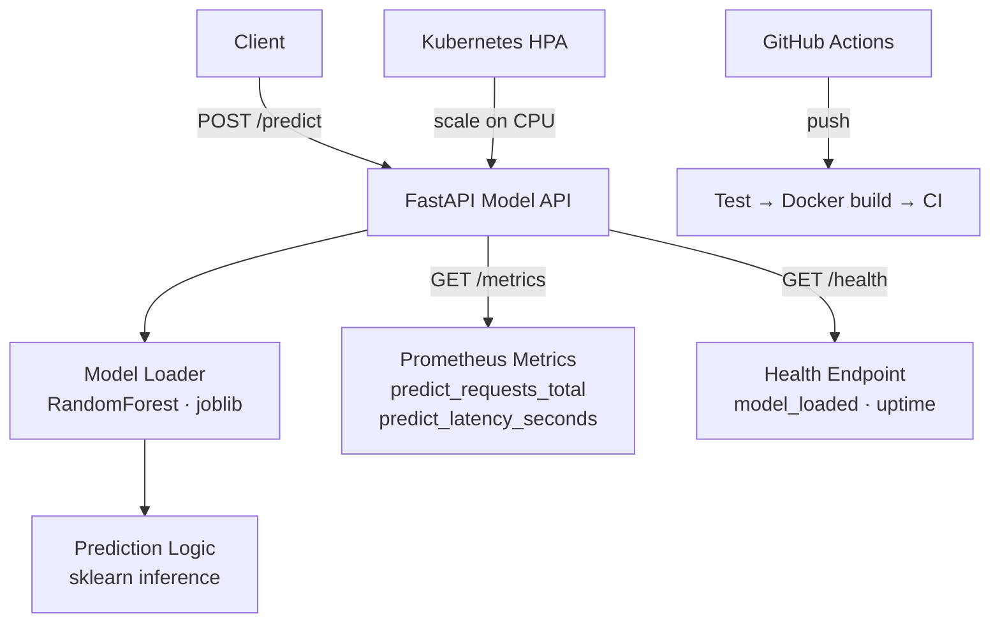

# MLOps Model Serving Platform

[](https://github.com/gaurav-sng2002/mlops-model-serving-platform/actions)


A **production-style MLOps platform** that serves a trained scikit-learn model via FastAPI.  
Includes real Prometheus metrics, Kubernetes HPA manifests, Docker, CI, and a pre-trained Iris classifier.

> Runs immediately — no cloud account, no pretrained model download. The API trains a `RandomForestClassifier` on startup if no saved model is found.

---

## Architecture



---

## Quick start

```bash
git clone https://github.com/gaurav-sng2002/mlops-model-serving-platform
cd mlops-model-serving-platform

python -m venv .venv && source .venv/bin/activate
pip install -r requirements.txt

make dev
# → http://localhost:8000/docs
```

Docker:
```bash
docker compose up --build
```

Kubernetes:
```bash
kubectl apply -f k8s/
kubectl get pods -w
```

---

## API endpoints

| Method | Endpoint | Description |
|--------|----------|-------------|
| `GET` | `/health` | Liveness + model_loaded flag |
| `POST` | `/predict` | Run inference on feature vector |
| `GET` | `/metrics` | Prometheus metrics (scrape-ready) |
| `GET` | `/docs` | Swagger UI |

### Sample requests & responses

**Health check**
```bash
curl http://localhost:8000/health
```
```json
{
  "status": "ok",
  "model_loaded": true,
  "uptime_seconds": 8.3,
  "version": "1.0.0"
}
```

**Predict — Iris setosa**
```bash
curl -X POST http://localhost:8000/predict \
  -H "Content-Type: application/json" \
  -d '{"features": [5.1, 3.5, 1.4, 0.2]}'
```
```json
{
  "prediction": 0,
  "label": "setosa",
  "confidence": 1.0,
  "model": "RandomForestClassifier",
  "latency_ms": 2.1
}
```

**Predict — Iris versicolor**
```bash
curl -X POST http://localhost:8000/predict \
  -H "Content-Type: application/json" \
  -d '{"features": [6.0, 2.9, 4.5, 1.5]}'
```
```json
{
  "prediction": 1,
  "label": "versicolor",
  "confidence": 0.94,
  "model": "RandomForestClassifier",
  "latency_ms": 1.8
}
```

**Prometheus metrics (scrape)**
```bash
curl http://localhost:8000/metrics
```
```
# HELP predict_requests_total Total prediction requests
# TYPE predict_requests_total counter
predict_requests_total 42.0
# HELP predict_latency_seconds Prediction latency
# TYPE predict_latency_seconds histogram
predict_latency_seconds_bucket{le="0.005"} 41.0
...
```

---

## Model details

| Property | Value |
|----------|-------|
| Algorithm | `RandomForestClassifier` (n_estimators=50) |
| Dataset | Iris (150 samples, 4 features, 3 classes) |
| Accuracy | ~97% on held-out test set |
| Serialization | `joblib` → `models/model.joblib` |
| Auto-train | Yes — trains on first startup if no saved model found |

**Input features** (4 floats): sepal length, sepal width, petal length, petal width (in cm)

---

## Project structure

```
mlops-model-serving-platform/
├── app/
│   ├── main.py          # FastAPI routes, Prometheus middleware
│   ├── model_loader.py  # RandomForest train/load/predict
│   └── __init__.py
├── k8s/
│   ├── deployment.yaml  # 2-replica deployment, resource limits
│   ├── service.yaml     # LoadBalancer service
│   └── hpa.yaml         # HPA: scale 2→10 on CPU > 60%
├── tests/
│   └── test_api.py      # 5 pytest cases
├── Dockerfile
├── docker-compose.yml
├── Makefile
└── requirements.txt
```

---

## Makefile commands

```bash
make install      # pip install
make dev          # uvicorn --reload
make test         # pytest -v
make docker-build # docker build
make docker-run   # docker run -d
make k8s-apply    # kubectl apply -f k8s/
```

---

## Kubernetes HPA

The `k8s/hpa.yaml` scales replicas from **2 → 10** when CPU utilization exceeds 60%:

```yaml
minReplicas: 2
maxReplicas: 10
metrics:
  - type: Resource
    resource:
      name: cpu
      target:
        type: Utilization
        averageUtilization: 60
```

---

## Roadmap

- [ ] MLflow model registry integration
- [ ] Canary deployment example (10% / 90% split)
- [ ] Model drift monitoring with Evidently
- [ ] Load testing with k6
- [ ] Replace Iris with a real-world dataset
