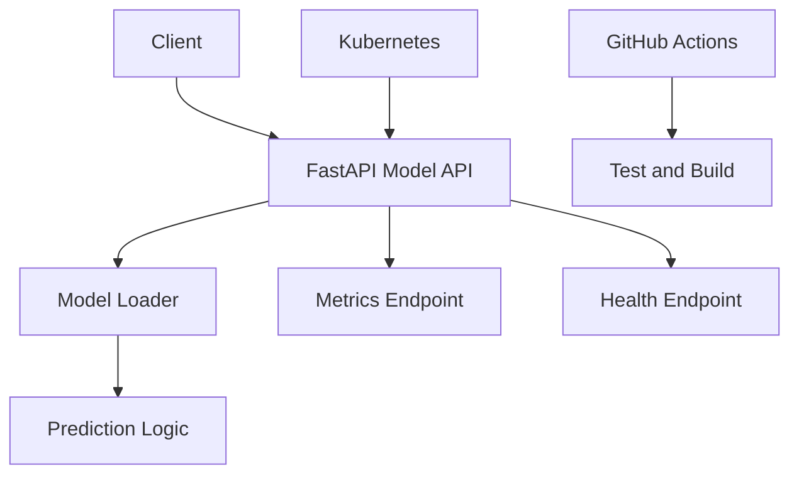

# MLOps Model Serving Platform

Dockerized model-serving API that demonstrates production-style MLOps basics: prediction endpoint, health checks, metrics, tests, CI, and Kubernetes deployment manifests.

## Architecture



## API endpoints

| Endpoint | Purpose |
|---|---|
| `GET /health` | Liveness check |
| `POST /predict` | Model inference |
| `GET /metrics` | Prometheus-style metrics |

## Local setup

```bash
python -m venv .venv
source .venv/bin/activate
pip install -r requirements.txt
uvicorn app.main:app --reload
```

Docker:

```bash
docker build -t mlops-model-serving-platform .
docker run -p 8000:8000 mlops-model-serving-platform
```

Kubernetes:

```bash
kubectl apply -f k8s/
```

## Roadmap

- Add MLflow model registry integration.
- Add canary deployment example.
- Add autoscaling with HPA metrics.
- Add model drift monitoring example.
